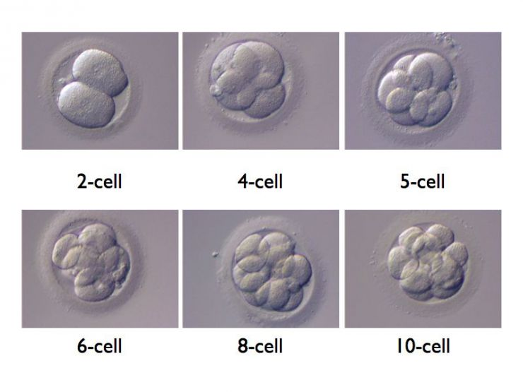
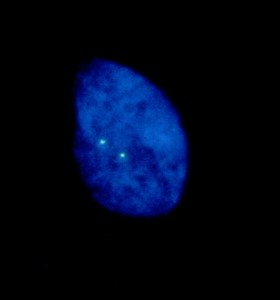
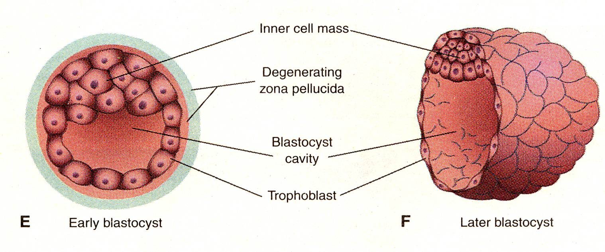
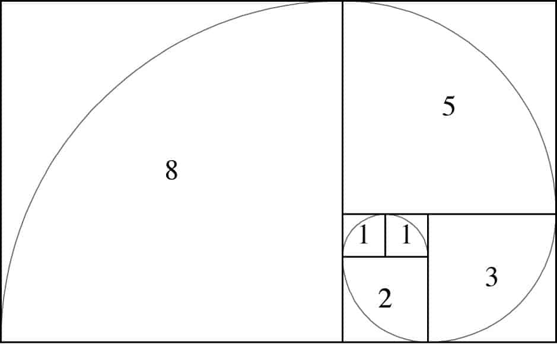

```{css, echo=FALSE}
.answer_input {
  background-color: lightgrey;
  border: 1px solid green;
  font-weight: normal;
}

.answer_output {
  background-color: lightgreen;
  border: 2px solid green;
  font-weight: bold;
}
```

```{r setup, include=FALSE, warning=FALSE, echo=F, message=F}
suppressMessages(library(tessera))
suppressMessages(library(plotly))
suppressMessages(library(magrittr))
suppressMessages(library(ggplot2))
suppressMessages(library(animation))
suppressMessages(library(patchwork))
suppressMessages(library(parallel))

# Plot the biopsy results
plot.biopsy.aneuploidy = function(n.biopsy.aneuploid, biopsy.size, pct.embryo.aneuploid){
  pct.biopsy.aneuploid = n.biopsy.aneuploid / biopsy.size * 100
  biopsy.data = as.data.frame(pct.biopsy.aneuploid) %>%
    dplyr::group_by(pct.biopsy.aneuploid) %>%
    dplyr::summarise(n = dplyr::n()) %>%
    dplyr::mutate(PctBiopsies = n/sum(n)*100)
  
  # Number of biopsies
  ggplot(biopsy.data, aes(x=pct.biopsy.aneuploid, y = PctBiopsies)) +
    geom_col(width = 1) +
    coord_cartesian(xlim = c(0, 100), 
                    ylim = c(0, 100)) +
    scale_x_continuous(breaks = seq(0, 100, 20)) +
    scale_y_continuous(breaks = seq(0, 100, 10)) + 
    labs(x = "Percent aneuploid cells in biopsy",
         y = "Percent of biopsies from this embryo") +
    theme_classic()
}

read.rds.data = function(name){
 filename = paste0("data/",name, ".Rds")
  if(file.exists(filename)){
    return(readRDS(filename))
  }
}

```


## 1990s: Pre-implantation genetic diagnosis (PGD)

- Detect genetic disease in embryos e.g. cystic fibrosis ΔF508

<div class="centered">
```{r, out.width="50%", out.height="50%", echo=F}
knitr::include_graphics("Slide_figures/handyside.png")
```

```{r, out.width="50%", out.height="50%", echo=F}
knitr::include_graphics("Slide_figures/cf_diagnosis.png")
```
</div>

## 1990s: Pre-implantation genetic diagnosis (PGD)

<div class="centered">
```{r, out.width="50%", out.height="50%", echo=F}

```
</div>

- biopsy single cell, PCR for allele of interest

## 1990s: FISH for specific chromosome

e.g. X-linked recessive disorder

<div class="centered">
```{r, out.width="40%", out.height="40%", echo=F}

```
</div>


## 2000s: Assay aneuploidy - e.g. multicolour FISH

<div class="centered">
```{r, out.width="50%", out.height="50%", echo=F}
knitr::include_graphics("Slide_figures/Multi-colour_PGS.PNG")
```
</div>

## 2000s: Measure all the things

- Microarrays (CGH, SNPs), and later sequencing
- But now DNA amplification is needed

- DOP-PCR sucks with low amount of template


Two routes taken:

- Amplify DNA more robustly e.g MDA

- OR ...


## ... wait for blastocyst stage - 150-200 cells

<div class="centered">
```{r, out.width="50%", out.height="50%", echo=F}

```
</div>

- Inner cell mass separated from trophectoderm
- Biopsy ~5 cells from trophectoderm


## ... wait for blastocyst stage - 150-200 cells

<div class="centered">
```{r, out.width="50%", out.height="50%", echo=F}

```
</div>

- Inner cell mass separated from trophectoderm
- Biopsy 5 cells from trophectoderm

BUT

- does TE biopsy reflect ICM? 
- Also we now see mosaicism
- Bother

## The question(s)

<div class="centered">
How well does a mosaic biopsy represent an embryo?

What can we confidently interpret from a biopsy?


_Solution_:

Create a virtual embryo that we can repeatedly biopsy 

</div>

## Segue through the sunflowers

To model an embryo, we need a ball of cells

- sphere with cells evenly spaced on surface

- turn to the Fibonacci series

`1, 1, 2, 3, 5, 8, 13, 21 ...`

<div class="centered">
```{r, out.width="50%", out.height="50%", echo=F}

```
</div>


## Segue through the sunflowers

<div class="centered">
```{r, out.width="50%", out.height="50%", echo=F}

```
</div>

- Project a Fibonacci spiral into spherical coordinates

## A toy embryo


```{r, echo=FALSE, warning=FALSE, cache=FALSE, results='asis', message=F }
e = plot(tessera::Embryo(n.cells = 200, prop.aneuploid = 0))

# htmlwidgets::saveWidget(as_widget(e), "e.html")
cat('<iframe src="./Slide_figures/e.html" style="position:absolute;width:70%;height:70%"> </iframe>')

```

## A toy embryo with 20% aneuploidy

```{r, echo=FALSE, warning=FALSE, cache=FALSE, results='asis', message=F, fig.width=70, fig.height=70 }


e2 = plot(tessera::Embryo(n.cells = 200, prop.aneuploid = 0.2, 
                          dispersal = 1, rng.seed = 1))

# htmlwidgets::saveWidget(as_widget(e2), "e2.html")
cat('<iframe src="./Slide_figures/e2.html" style="position:absolute;width:70%;height:70%"> </iframe>')


```


## A toy embryo with 20% aneuploidy, clustered


```{r, echo=FALSE, warning=FALSE, cache=FALSE, results='asis', message=F}

e3 = plot(tessera::Embryo(n.cells = 200, prop.aneuploid = 0.2, 
                          dispersal = 0, rng.seed = 1))

# htmlwidgets::saveWidget(as_widget(e3), "e3.html")
cat('<iframe src="./Slide_figures/e3.html" style="position:absolute;width:70%;height:70%"> </iframe>')

```

## A toy embryo with 20% aneuploidy

```{r, echo=F, fig.align='center', out.width="90%"}
b = tessera::takeAllBiopsies(tessera::Embryo(n.cells = 200, prop.aneuploid = 0.2, 
                          dispersal = 1, rng.seed = 1), biopsy.size = 5, chromosome = 1)

b2 = tessera::takeAllBiopsies(tessera::Embryo(n.cells = 200, prop.aneuploid = 0.2, 
                          dispersal = 0, rng.seed = 1), biopsy.size = 5, chromosome = 1)

plot.biopsy.aneuploidy(b, 5, 0.2)+labs(title="Dispersed") + plot.biopsy.aneuploidy(b2, 5, 0.2)+labs(title="Clustered")
```

## Things to measure

- aneuploidy

- dispersal

- biopsy size

- number of biopsies

## Effect of changing aneuploidy (high dispersal)

<div class="centered">
```{r, out.width="70%", out.height="70%", echo=F}
knitr::include_graphics("Aneuploidy.gif")
```
</div>


## Effect of changing aneuploidy (high dispersal)

<div class="centered">
```{r, out.width="70%", out.height="70%", echo=F}
aneuploidy.step.plot = read.rds.data("Old/aneuploidy.step.plot")
aneuploidy.step.plot
```
</div>

## Effect of changing dispersal (20% aneuploidy)

<div class="centered">
```{r, echo=FALSE, cache=F, fig.show='hold'}
dispersal.step.plot = read.rds.data("Old/dispersal.step.plot")
dispersal.step.plot
```
</div>

## Effect on PGDIS classifications

Preimplantation Genetic Diagnosis International Society

- <20% aneuploid cells: euploid
- 20% - <40%: low level mosaic
- 40% - 80%: high level mosaic
- >80%: aneuploid

Does the biopsy class match the embryo class?

## Effect on PGDIS classifications

```{r, eval=T, echo=FALSE, warning=F, message=F, cache=F, fig.show='hold', fig.align='center', out.width="90%" }
dispersal.aneuploidy.heatmap = read.rds.data("dispersal.aneuploidy.heatmap")
dispersal.aneuploidy.heatmap
```

## Effect of changing biopsy size (dispersed, 20% aneuploidy)

```{r, eval=T, echo=FALSE, cache=F, fig.show='hold', fig.align='center'}
biopsy.size.step.plot = read.rds.data("Old/biopsy.size.step.plot")
biopsy.size.step.plot
```


## Effect of changing biopsy size - all combinations

```{r, eval=T, echo=FALSE, cache=F, fig.show='hold', fig.align='center', out.height="120%"}
dispersal.aneuploidy.biopsy.heatmap = read.rds.data("dispersal.aneuploidy.biopsy.heatmap")
dispersal.aneuploidy.biopsy.heatmap
```


## What can we learn about an embryo from a biopsy?

- suppose we have a 5-cell biopsy with 1 aneuploid cell

## What can we learn about an embryo from a biopsy?

- suppose we have a 5-cell biopsy with 1 aneuploid cell
- generate all biopsies from the aneuploidy and dispersal parameter space

<div class="centered">
```{r, eval=F, echo=FALSE, warning=F, message=F, cache=F, fig.show='hold', fig.height=4}
embryo.combination.plot = read.rds.data("Old/embryo.combination.plot")
embryo.combination.plot
```
</div>

## Which embryos could yield our biopsy?

- biopsies with a single aneuploid cell come from embryos with the following parameters:

<div class="centered">
```{r, eval=T, echo=FALSE, warning=F, message=F, cache=F, fig.show='hold'}
embryo.combination.source.plot = read.rds.data("Old/embryo.combination.source.plot")
embryo.combination.source.plot
```
</div>

## Probable origins for all 5-cell biopsies

<div class="centered">
```{r, eval=T, echo=FALSE, warning=F, message=F, cache=F, fig.show='hold'}
embryo.combination.all.plot = read.rds.data("Old/embryo.combination.all.plot")
embryo.combination.all.plot
```
</div>

## PGDIS classes for a biopsy with 1 aneuploid cell (low level)

<div class="centered">
```{r, echo=F, message=F, warning=F}
single.biopsy.pgdis.plot = read.rds.data("Old/single.biopsy.pgdis.plot")
single.biopsy.pgdis.plot
```
</div>

## How well can we predict embryo status?

- Not very well with a 5 cell biopsy

<div class="centered">
```{r heatmap-1x5, eval=T, echo=FALSE, warning=F, message=F, cache=F, fig.height= 4, fig.width=10}
heatmap.1x5 = read.rds.data("Old/heatmap.1x5")
heatmap.1x5
```
</div>


## What about a 10 cell biopsy?

- Not much better at low dispersal

<div class="centered">
```{r heatmap-1x10, eval=T, echo=FALSE, warning=F, message=F, cache=F, fig.height= 4, fig.width=10 }
heatmap.1x10 = read.rds.data("Old/heatmap.1x10")
heatmap.1x10
```
</div>

## Or two 5-cell biopsies?

- Not much difference to a 10-cell biopsy

<div class="centered">
```{r heatmap-2x5, eval=T, echo=FALSE, warning=F, message=F, cache=F, fig.height=4, fig.width=10 }

heatmap.2x5 = read.rds.data("Old/heatmap.2x5")
heatmap.2x5
```
</div>

## What this means for accuracy

- A biopsy is limited in predicting an individual embryo's state

<div class="centered">
```{r pgdis-2x5, eval=T, echo=FALSE, warning=F, message=F, cache=F, fig.height=5 }
pgdis.plot.1x5 = read.rds.data("Old/pgdis.plot.1x5")
pgdis.plot.1x10 = read.rds.data("Old/pgdis.plot.1x10")
pgdis.plot.2x5 = read.rds.data("Old/pgdis.plot.2x5")
pgdis.plot.1x5
```
</div>


## Summary

- models can help us visualise possibilities
- suggest results outside 0% or 100% aneuploid biopsies should be considered 'non-informative'

BUT

- models are not perfect - what are the biological constraints on these parameters?


## Acknowledgements

- Darren Griffin, University of Kent

- Peter Ellis, University of Kent


Model available at reproduction.essex.ac.uk


